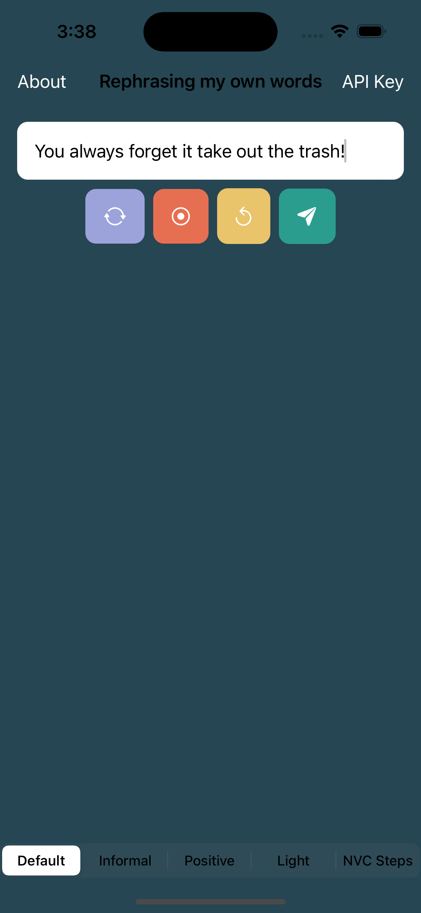
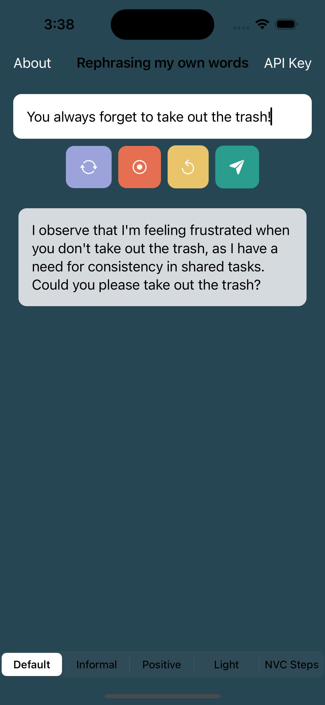
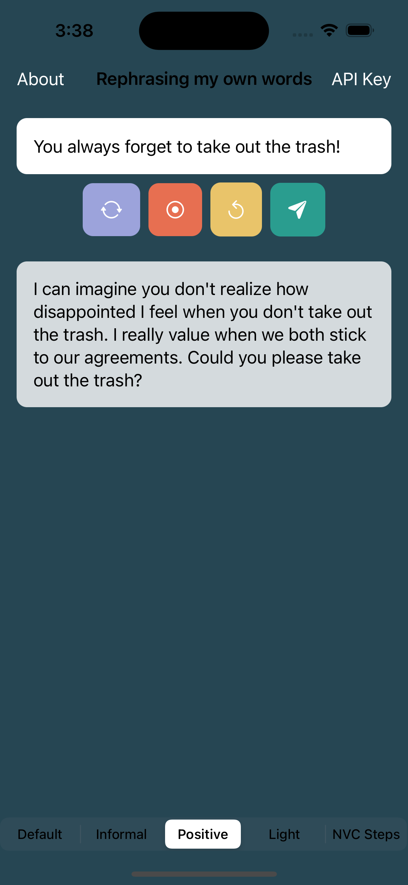
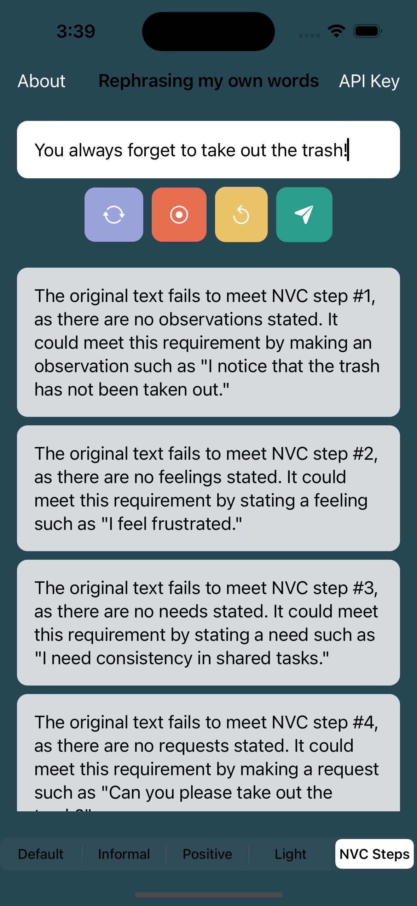
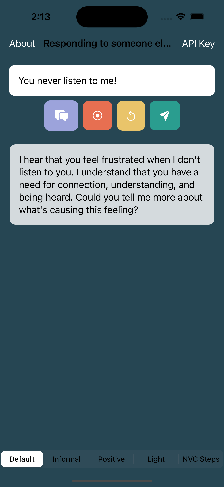
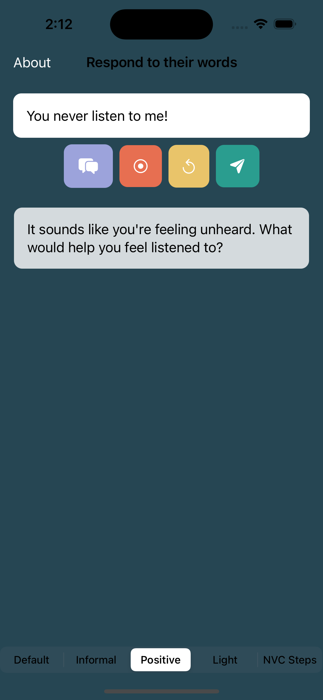
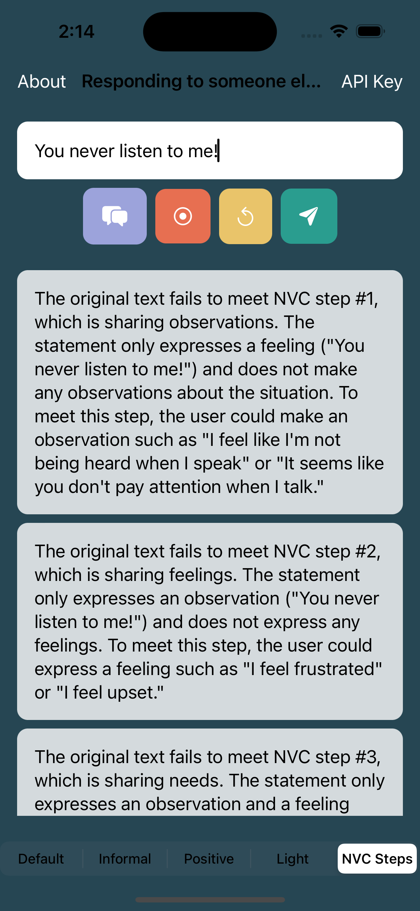
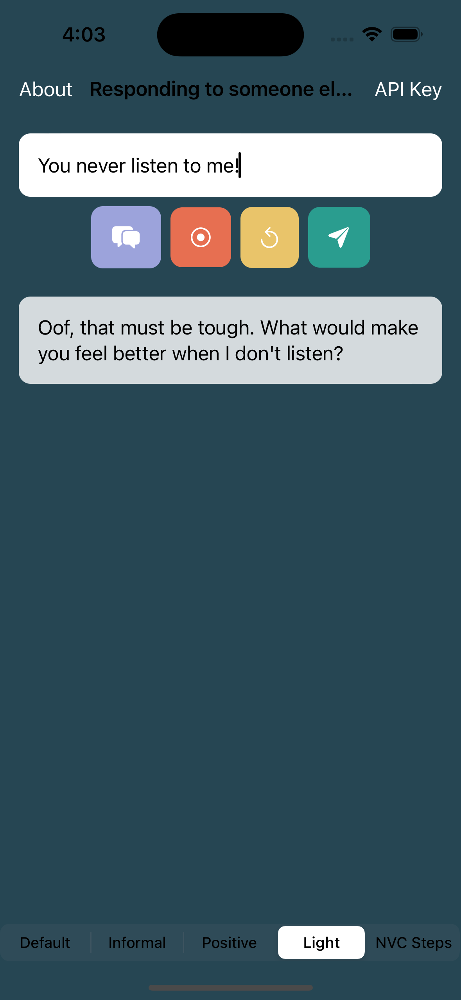

# ChatNVC

ChatNVC is an iOS app designed to help users translate given phrases into Nonviolent Communication (NVC), utilizing Marshall Rosenberg's techniques as outlined in his book of the same name. This is an unofficial app for practicing NVC.

## Features

- Leverages the OpenAI API to rephrase phrases into nonviolent communication.
- Supports typing text input or speech-to-text capture.
- Provides four distinct styles of rephrasing: Default, Informal, Light, and Positive.
- Returns an analysis of how the phrase aligns with the four steps of NVC, along with suggestions for improving alignment if needed.
- Supports two modes: "Rephrase my own words" and "Responding to someone else's words".

## Screenshots

### Rephrase my own words
<table>
  <tr>
    <td>
      
    </td>
    <td>
      
    </td>
    <td>
      
    </td>
    <td>
      
    </td>
  </tr>
</table>

### Responding to someone else's words
<table>
  <tr>
    <td>
      
    </td>
    <td>
      
    </td>
    <td>
      
    </td>
    <td>
      
    </td>
  </tr>
</table>

## Requirements

To build and run the app, you need:

- Xcode 13.0 or later
- Swift 5.5 or later
- An OpenAI account with a valid API key.

These versions are recommended as of the last update. The app might work with earlier versions of Xcode and Swift, but compatibility is not guaranteed.

## Installation

1. Clone this repository.
2. Open the `.xcodeproj` file in Xcode.
3. Copy the `.env.example` file and rename the copy to `.env`.
4. Open the `.env` file and replace `your_api_key_here` with your actual OpenAI API key.

## Usage

1. Launch the app.
2. Choose between "Rephrase my own words" and "Responding to someone else's words" mode.
3. Type or speak a phrase.
4. Press the Send button to get the rephrased version of the phrase.
5. Choose from one of the four response styles at the bottom of the screen.

## Known Issues and Limitations

- Adding an OpenAI API key through the app is not currently supported. The API key must be added through the Build Settings tab in Xcode.
- Responses from the OpenAI API can take up to 20 seconds to generate.
- As the responses are generated dynamically through the OpenAI API, there may be occasional issues with response formatting or content that are outside the control of the app.

## Contributing

Contributions, issues, and feature requests are welcome. Feel free to check the Issues page if you want to contribute. For major changes, please open an issue first to discuss what you would like to change.

## License

This project is licensed under the MIT License.
